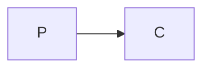
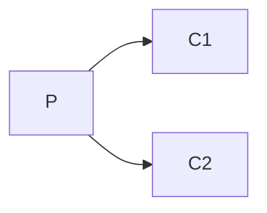
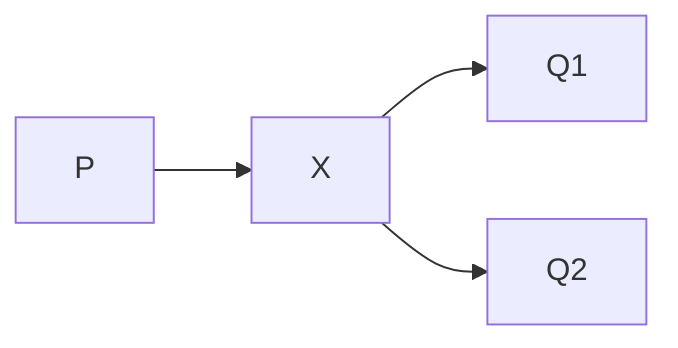
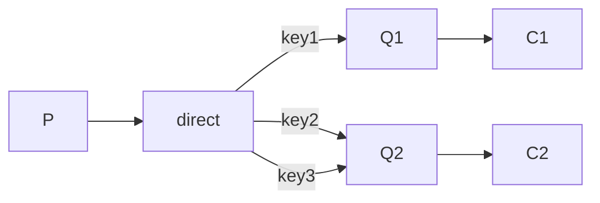

# RabbitMQ

## Install

[website](https://www.rabbitmq.com/)

- Operating System: MacOS Sonoma Version 14.0

```bash
brew install rabbitmq
```

```bash
#start a node in the foreground
CONF_ENV_FILE="/opt/homebrew/etc/rabbitmq/rabbitmq-env.conf" /opt/homebrew/opt/rabbitmq/sbin/rabbitmq-server
#start a node in the background
brew services start rabbitmq

/opt/homebrew/sbin/rabbitmqctl enable_feature_flag all

#stop a running node
brew services stop rabbitmq
```

## Plugins

```bash
rabbitmq-plugins list

rabbitmq-plugins enable ....

rabbitmq-plugins disable ...
```

## Management

### Management UI

```bash
rabbitmq-plugins enable rabbitmq_management
```

- Access `http://</i>{node-hostname}</i?:15672/`

### Management HTTP API

- Access `http://<i>server-name</i>:15672/api/`

``` bash
curl -i -u username:password -H "..." -X... -d"{"..."} http://localhost:15672/api/...
```

## Virtual hosts

Allows you to host multiple domain names or logical grouping or resources on a single physical machine or server. Each virtual host operates a s if it were a separate instance of the service, with its own configuration settings, security permissions, and isolated namespaces.

In RabbitMQ, a virtual host is essentially a container ofr message queues, exchanges bindings, and users.

- Isolation: Resources are not shared with other virtual hosts.
- Logical grouping: One for development, another for testing, another for production.
- Security: Control which users or applications have access to which virtual hosts and what operations they can perform within those virtual hosts.
- Configuration

## User

When create a user, we must grant that user permission to access a virtual host.

## Queues

We can see all the message queue here.

A queue is declared within the connection's virtual host.

## Exchange

Exchange is a message routing entity that receives messages from producers and routes them to queues based on rules defined by bindings.

## Bind

Bind the exchange with queue.

## Go

We need a struct to represent RabbitMQ to meet the need.

```go
type RabbitMQ struct {
	conn      *amqp.Connection
	channel   *amqp.Channel
	QueueName string
	Exchange  string
	Key       string
	Mqurl     string
}
```

### Create and destory

```go
// create a instance of RabbitMQ
func NewRabbitMQ(queueName string, exchange string, key string) *RabbitMQ {
	return &RabbitMQ{QueueName: queueName, Exchange: exchange, Key: key, Mqurl: MQURL}
}

// close the channel and connection
func (r *RabbitMQ) Destory() {
	r.channel.Close()
	r.conn.Close()
}

func NewRabbitMQSimple(queueName, exchangeName, routingKey string) *RabbitMQ {
	rabbitmq := NewRabbitMQ(queueName, exchangeName, routingKey)
	var err error

	rabbitmq.conn, err = amqp.Dial(rabbitmq.Mqurl)
	rabbitmq.failOnErr(err, "failed to connect to RabbitMQ")

	rabbitmq.channel, err = rabbitmq.conn.Channel()
	rabbitmq.failOnErr(err, "failed to open a channel")

	return rabbitmq
}
```

### Error handling

```go
func (r *RabbitMQ) failOnErr(err error, message string) {
	if err != nil {
		log.Fatal("%s: %s", message, err)
		panic(fmt.Sprintf("%s: %s", message, err))
	}
}
```

### Apply Queue

```go
func (*amqp.Channel).QueueDeclare(name string, durable bool, autoDelete bool, exclusive bool, noWait bool, args amqp.Table) (amqp.Queue, error)
```

- name: Queue name
- durable: survive server restarts or crash
- autoDelete: delete the queue when all consume close the connection to it.
- exclusive: other user cannot watch your activity.
- noWait: wait for the server response.
- args: extra

### Apply Exchange

```go
func (*amqp.Channel).ExchangeDeclare(name string, kind string, durable bool, autoDelete bool, internal bool, noWait bool, args amqp.Table) error
```

- kind:
  - direct: default,
  - fanout: subscription mod
- internal: an internal exchange means spread messages between exchanges.

### Bind

```go
func (*amqp.Channel).QueueBind(name string, key string, exchange string, noWait bool, args amqp.Table) error
```

### Publish

```go
func (*amqp.Channel).Publish(exchange string, key string, mandatory bool, immediate bool, msg amqp.Publishing) error

amqp.Publishing{
  ContentType:"text/plain"
  Body:[]byte(message)
}
```

- exchange: default when empty
- key: queueName or routingKey
- mandatory: if true, return the message to publisher when cannot find correct queue according to exchange and routing key.
- immediate: if true, return message to publisher when exchange messages to queue which do not connect to any consumer.
- msg

### Consume

```go
func (*amqp.Channel).Consume(queue string, consumer string, autoAck bool, exclusive bool, noLocal bool, noWait bool, args amqp.Table) (<-chan amqp.Delivery, error)


	msgs, err := channel.Consume(...)
	forever := make chan(bool)
	go func() {
  	for d := range msgs {
  	  ...
  	}
	}()
	log.Printf("[*] Waiting for messages. To exit press CTRL+C")
	<-forever
```

- queue
- consumer: differ consumers.
- autoAck: acknoledge rabbitmq the message is consumed.
- exclusive
- noLocal: if true,the comsumer do not want to receive message that were published on the same connection.
- noWait: whether the server should wait available message to send to consumer.If true, send a empty message if there are no available messages.
- args
- <-chan amp.Delivery: a channel that continueously receive messages from the queue. So in the goroutine, the loop will never meet the end.

## Mod

### Simple



```go
//Only need queueName
//publish 
QueueDeclare
```

```sh
go run SimpleConsume.go
go run SimplePublish.go
```

### Work



```sh
go run SimpleConsume.go
...
go run SimpleConsume.go
go run SimplePublish.go
```

### Publish/Subscribe



Message send to exchange, exchange send message to multiple queues, queue send to consumer.

```go
//Only need ExchangeName
//publish kind:fanout comsume key:""
ExchangeDeclare
```

```go
go run SubConsume.go
...
go run SubConsume.go
go run SubPublish.go
```

### Routing



```go
//need ExchangeName and key
//publish kind:direct
ExchangeDeclare
```

```sh
go run RoutingConsume1.go
...
go run RoutingConsume2.go
go run RoutingPublish.go
```

### Topic

